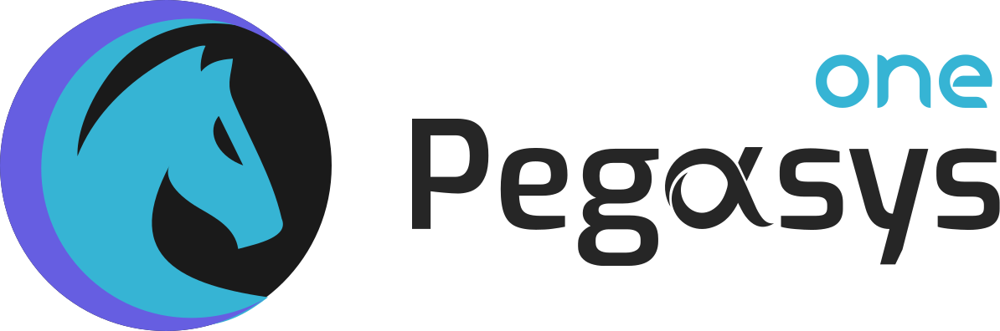

# Pegasys-One Core

    
  </a>

Incorporated with the innovative Discretized-Liquidity-AMM model, Pegasys One is a next-generation DEX to maximize capital efficiency by realizing Limit Order in a decentralized way.

Design and some details can be found in the paper [iZiSwap: Building Decentralized Exchange with Discretized Concentrated Liquidity and Limit Order](whitepaper/iZiSwap.pdf).